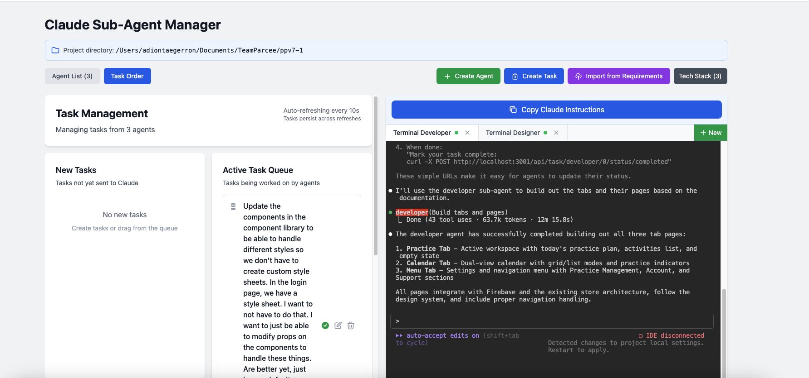

# Claude Sub-Agent Manager

A powerful CLI tool for managing Claude Code sub-agents in your projects. This tool provides an intuitive web interface to create, manage, and monitor multiple AI sub-agents that work together on your codebase.



## 🌟 Features

- **🤖 AI-Powered Agent Generation** - Use Claude to automatically generate sub-agent configurations
- **📦 Bulk Import** - Create multiple agents from project documentation or requirements
- **📊 Enhanced Dashboard** - Comprehensive project overview with metrics and progress tracking
- **🎯 Task Management** - Assign specific tasks to agents and track their completion
- **🔄 All Tasks View** - Drag-and-drop reordering of tasks across agents with sequential execution
- **📈 SQLite Task Tracking** - Reliable, persistent task progress tracking with SQLite database
- **🔄 Auto-Refresh** - Automatically updates status for active agents every 10 seconds
- **🎯 Batch Operations** - Start multiple agents with a single command
- **🗑️ Easy Management** - Edit, delete, and organize your sub-agents
- **📱 Modern UI** - Clean, responsive interface with collapsible sections and toast notifications
- **🖥️ Terminal Integration** - Web-based terminal for direct command execution
- **📁 Config Discovery** - Automatically finds config files by walking up the directory tree
- **🚀 Standalone CLI** - Install globally or locally and run from anywhere in your project

## 🚀 Installation

### Global Installation (Recommended)

```bash
npm install -g @adiontaegerron/claude-sub-agent-manager
# or
yarn global add @adiontaegerron/claude-sub-agent-manager
```

### Local Installation

```bash
npm install --save-dev @adiontaegerron/claude-sub-agent-manager
# or
yarn add -D @adiontaegerron/claude-sub-agent-manager
```

### Using npx (No Installation)

```bash
npx @adiontaegerron/claude-sub-agent-manager
```

### From Source

```bash
git clone https://github.com/adiontae-tp/claude-sub-agent-manager.git
cd claude-sub-agent-manager
npm install
npm run build
npm link  # Makes 'claude-agents' command available globally
```

## 🎯 Quick Start

### 1. Initialize your project

```bash
# In your project root directory
claude-agents init
```

This creates a `.claude-agents.json` config file in your project root.

### 2. Configure your API key

Choose one of these methods:

**Method 1: Environment Variable (Recommended for security)**
```bash
export ANTHROPIC_API_KEY="your-api-key-here"
claude-agents
```

**Method 2: Config File**
Add to your `.claude-agents.json`:
```json
{
  "projectName": "My Project",
  "apiKey": "your-api-key-here"
}
```

**Method 3: .env File**
Create a `.env` file in your project root:
```bash
echo 'ANTHROPIC_API_KEY=your-api-key-here' > .env
```

**Method 4: Pass it when running**
```bash
ANTHROPIC_API_KEY="your-api-key-here" claude-agents
```

### 3. Start the agent manager

```bash
# From anywhere in your project
claude-agents
```

The tool will automatically find your config file and start the web interface.

## 📁 Project Structure

After installation, your project will look like this:

```
your-project/
├── .claude-agents.json       # Configuration file
├── .claude/                  # Agent data directory (created automatically)
│   ├── agents/              # Agent markdown files
│   ├── agents-status/       # Agent status tracking
│   └── tech-stack.json      # Tech stack data
├── src/                     # Your project files
├── package.json
└── ...
```

## 🆓 Offline Mode (No API Credits Required!)

The tool now supports **Offline Mode** - use it without any Anthropic API credits:

### Features Available in Offline Mode:
- ✅ Manual agent creation
- ✅ Task management and tracking
- ✅ Terminal integration
- ✅ Agent templates (Frontend, Backend, QA, DevOps, UI/UX)
- ✅ Copy prompts to clipboard
- ✅ All organizational features

### Features Requiring API Credits:
- ❌ AI-powered agent generation
- ❌ Automatic prompt enhancement
- ❌ Bulk import from requirements

### To Enable Offline Mode:
Simply don't set an API key, or add to your `.claude-agents.json`:
```json
{
  "projectName": "My Project",
  "offlineMode": true
}
```

## 💰 Cost Optimization

To reduce API costs, the tool now uses Claude 3 Haiku by default, which is much cheaper than Sonnet. You can configure this in your `.claude-agents.json`:

```json
{
  "projectName": "My Project",
  "model": "claude-3-haiku-20240307",  // Default: Haiku (cheapest)
  "maxTokensPerRequest": 1000,         // Default: 1000 (reduced from 2000)
  "apiKey": "your-api-key"
}
```

### Available Models (from cheapest to most expensive):
- `claude-3-haiku-20240307` - Fastest and cheapest (default)
- `claude-3-5-sonnet-20241022` - More capable but more expensive
- `claude-3-opus-20240229` - Most capable but most expensive

### Tips to Reduce Costs:
1. Use Haiku model for most tasks (10x cheaper than Sonnet)
2. Reduce `maxTokensPerRequest` to limit response length
3. Be concise with agent prompts
4. Monitor your usage at https://console.anthropic.com/account/usage

## ⚙️ Configuration

### Config File Format

The `.claude-agents.json` file supports the following options:

```json
{
  "$schema": "https://raw.githubusercontent.com/adiontae-tp/claude-sub-agent-manager/main/.claude-agents.schema.json",
  "projectName": "My Awesome Project",
  "agentsDirectory": ".claude/agents",
  "techStackFile": ".claude/tech-stack.json",
  "templatesDirectory": ".claude/templates",
  "apiKey": "sk-...",  // Optional, can use env var instead
  "server": {
    "port": 3001,
    "autoOpen": true
  }
}
```

### Config Discovery

The CLI searches for config files in this order:
1. Path specified with `--config` flag
2. Current directory
3. Parent directories (up to project root)
4. Stops at first `.git` or `package.json` found

Supported config file names:
- `.claude-agents.json`
- `.claude-agents.yaml`
- `.claude-agents.yml`

## 🖥️ CLI Commands

### Main Command

```bash
claude-agents [options]
```

**Options:**
- `-c, --config <path>` - Path to config file
- `-r, --root <path>` - Project root directory
- `-p, --port <number>` - Port to run server on (default: 3001)
- `--no-browser` - Don't open browser automatically
- `-h, --help` - Display help
- `-V, --version` - Display version

### Initialize Command

```bash
claude-agents init
```

Creates a new `.claude-agents.json` config file in the current directory.

### Examples

```bash
# Start with default config
claude-agents

# Use specific config file
claude-agents --config ./config/agents.json

# Run on different port
claude-agents --port 8080

# Don't open browser
claude-agents --no-browser

# Specify project root
claude-agents --root /path/to/project
```

## 📋 Usage from Any Directory

Once installed and configured, you can run `claude-agents` from any subdirectory:

```bash
cd your-project/src/components
claude-agents  # Still finds config in project root

cd ../utils
claude-agents  # Works here too!
```

## 🔧 Advanced Features

### Tech Stack Integration

Create a `.claude/tech-stack.json` file to provide context about your project:

```json
{
  "frontend": ["React", "TypeScript", "Tailwind CSS"],
  "backend": ["Node.js", "Express", "PostgreSQL"],
  "tools": ["Webpack", "ESLint", "Jest"]
}
```

### Custom Agent Templates

Place custom templates in your templates directory:

```markdown
---
name: frontend-specialist
specialization: React and TypeScript development
---

You are a frontend development specialist focusing on React and TypeScript...
```

### Task Management

Agents support SQLite-based task tracking with:
- Progress tracking
- Subtask management
- Status updates
- Batch operations

## 🤝 Contributing

Contributions are welcome! Please read our contributing guidelines and submit PRs.

## 📄 License

MIT License - see LICENSE file for details.

## 🐛 Troubleshooting

### Common Issues

1. **Config file not found**
   - Ensure `.claude-agents.json` exists in your project root
   - Check file permissions

2. **API key errors**
   - Verify your Anthropic API key is set correctly
   - Check environment variables with `echo $ANTHROPIC_API_KEY`

3. **Port already in use**
   - Use `--port` flag to specify a different port
   - Check for other running instances

### Debug Mode

Run with debug output:
```bash
DEBUG=claude-agents claude-agents
```

## 📚 Resources

- [Documentation](https://github.com/adiontae-tp/claude-sub-agent-manager/wiki)
- [API Reference](https://github.com/adiontae-tp/claude-sub-agent-manager/wiki/API)
- [Examples](https://github.com/adiontae-tp/claude-sub-agent-manager/tree/main/examples)
- [Changelog](https://github.com/adiontae-tp/claude-sub-agent-manager/blob/main/CHANGELOG.md)